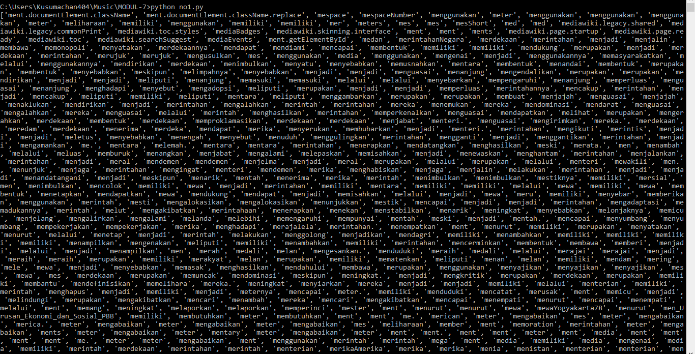
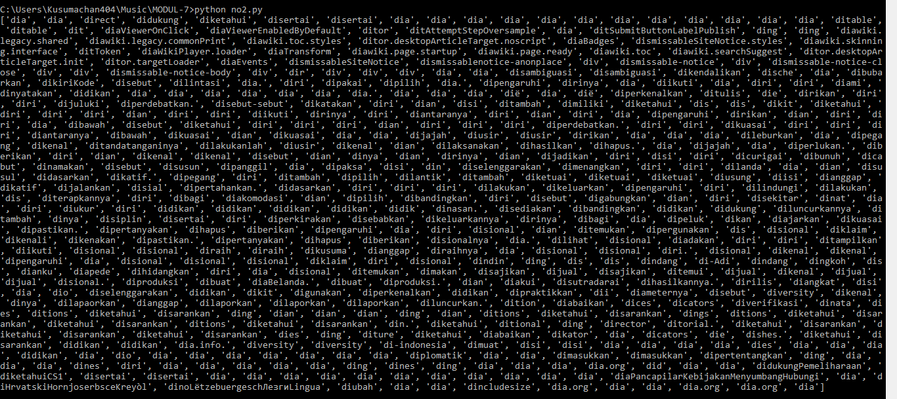
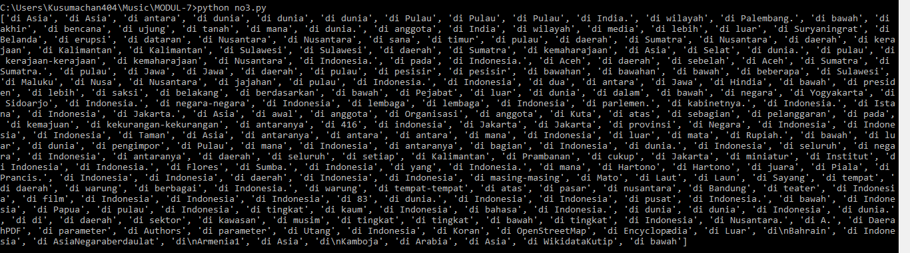
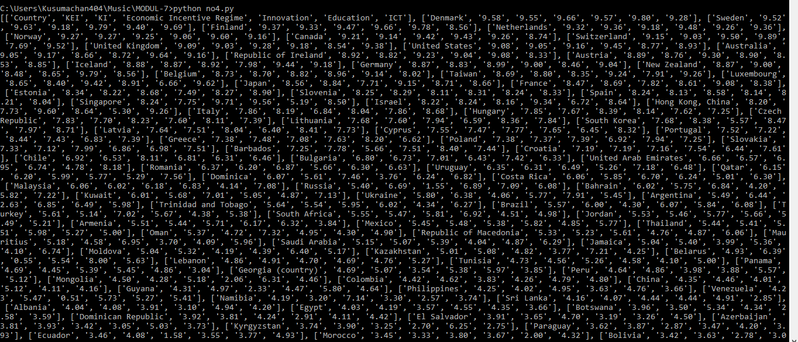

<pre>
	Nama  : Bintang Citra Kusumaatmaja
	Nim   : L200170078
	Kelas : C
</pre>

	Soal Mahasiswa Praktikum Algoritma dan Struktur Data MODUL 7 Universitas Muhammadiyah Surakarta. Dengan Materi :

<b>Regular Expressions</b>

	Pada Kasus SOAL Mahasiswa Praktikum MODUL 7 menggunakan Regular Expression untuk
	melakukan Scraping Data dari Sebuah Website.

Agar mudah di jalankan dan mudah untuk di kirimkan, jawaban modul ini sengaja saya buat tidak menggunkan file mentah html/txt akan tetapi langsung scraping ke website target. Oleh karena itu Ada beberapa Requirement untuk menjalankan Program ini yakni :

<ol>
	<li>Python 3</li>
	<li>Pip python</li>
	<li>BeautifulSoup Library</li>
	<li>Koneksi internet</li>
</ol>

Setelah Menyiapkan Requirement diatas,  setalah di eksekusi akan menghasilkan seperti berikut:

<ol>
	<li>SCREENSHOT SEBAGAIN NO 1</li>
	
	<li>SCREENSHOT SEBAGAIN NO 2</li>
	
	<li>SCREENSHOT SEBAGAIN NO 4</li>
	
	<li>SCREENSHOT SEBAGAIN NO 5</li>
	
</ol>
